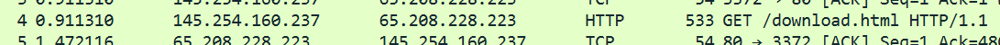
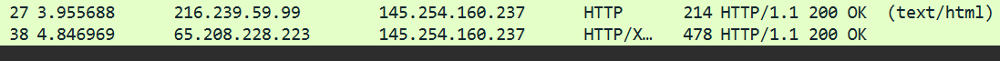
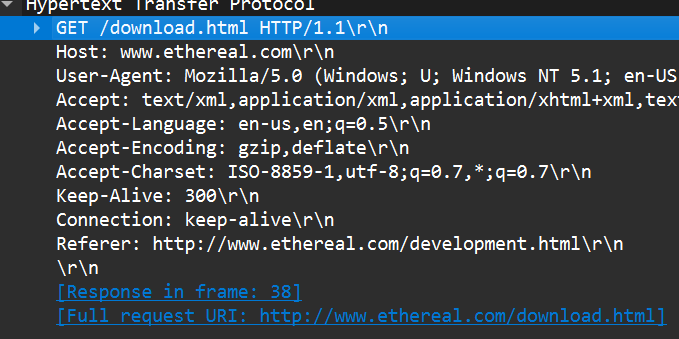

<h1 align = center>
    Tugas Reviu
</h1>

<h2>
1.	Analisa File http.cap
</h2>

a. Versi HTTP :

 

Dapat dilihat di baris 4 yang mana menunjukkan HTTP request dengan metode GET, di akhir baris 4 terdapat HTTP/1.1 yang menunjukkan versi dari HTTP tersebut yaitu 1.1. Kemudian ada juga di baris 27 dan 38 terdapat juga HTTP/1.1. Sehingga versi HTTP yang digunakan pada proses komunikasi tersebut adalah HTTP/1.1
   
b. IP address Client dan Server

 
 
Dilihat dari gambar di atas, menunjukkan bahwa client sebagai source pada alamat IP 145.254.160.237 mengirim request ke server dengan alamnat IP 65.208.228.223 sebagai destination, sedangkan server (65.208.228.223) menerima request dan mengirim response sebagai source dan diterima oleh client (145.254.160.237) sebagai destination.
- IP address client : 145.254.160.237
- IP address server : 65.208.228.223
  	
c. Waktu client mengirimkan HTTP request

Mengetahui waktunya dengan melihat paket yang mengirimkan HTTP Request, dapat ditemukan di kolom time pada baris 4. Waktu client mengirimkan adalah 0.911310
  	
d. Waktu server menerima response

Bisa dilihat pada kolom time tersebut menunjukkan waktu HTTP response dari request si client pada baris 4. Bisa dilihat juga di HTTP request, buka bagian Hypertext Transfer Protocol dan cari informasi "[Response In frame: 38]". Memberitahu Informasi paket yang berisi respons dari server terhadap request yang dikirim oleh client.

Sehingga waktu menerima yang dibutuhkan oleh server adalah 4.846969 detik
  
e. Waktu tranfer dan response dari client ke server

Waktu tersebut dapat dihitung dari selisih client pertama mengirim dan diterima oleh server,

4.846969 – 0.911310 = 3.935659

Sehingga, waktu yang dibutuhkan untuk transfer dan response dari client ke server adalah 3.935659 detik

<h2>
2.	Analisis Gambar
</h2>

Berdasarkan gambar tersebut terdapat beberapa jenis pengiriman yang terjadi :

1. Node to node : Data link layer

Pengiriman node-to-node terjadi antar perangkat jaringan yang berdekatan, seperti komputer ke router atau router ke router. Pada tahap ini, lapisan data link berperan dalam mengatur bagaimana data berpindah antar node menggunakan alamat fisik perangkat, yaitu MAC address. MAC address digunakan untuk mengidentifikasi perangkat dalam satu jaringan lokal (LAN) sehingga data dapat dikirim ke tujuan yang tepat. Data dikemas dalam bentuk frame dan dikirim menggunakan metode seperti Ethernet atau Wi-Fi. Proses ini memastikan bahwa data sampai ke node berikutnya sebelum diteruskan lebih jauh ke tujuan akhirnya.

2. Host to host : Network layer

Pengiriman host-to-host terjadi antara dua perangkat dalam jaringan yang berbeda. Lapisan network bertanggung jawab dalam menentukan jalur terbaik bagi data agar bisa sampai ke perangkat tujuan menggunakan alamat IP. Data melewati berbagai router dalam jaringan, dan protokol seperti IP memastikan bahwa paket-paket data dikirim ke alamat yang benar.

3. Procces to procces : Transport layer

Pengiriman process-to-process berfokus pada komunikasi antara aplikasi di perangkat pengirim dan penerima. Lapisan transport mengatur pengelolaan koneksi menggunakan protokol seperti TCP dan UDP. TCP menjamin data diterima dengan urutan yang benar dan tanpa kesalahan, sedangkan UDP memungkinkan pengiriman lebih cepat tetapi tanpa jaminan keutuhan data.

<h2>
3.	Tahapan TCP
</h2>

a. Connection establishment

