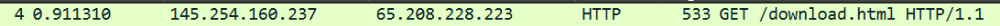
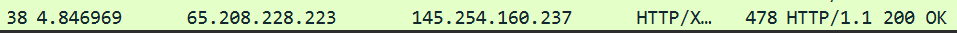

<h1 align = center>
    Tugas Reviu
</h1>

<h2>
1.	Analisa File http.cap
</h2>

a. Versi HTTP :

 

Dapat dilihat di baris 4 yang mana menunjukkan HTTP request dengan metode GET, di akhir baris 4 terdapat HTTP/1.1 yang menunjukkan versi dari HTTP tersebut yaitu 1.1. Kemudian ada juga di baris 27 dan 38 terdapat juga HTTP/1.1. Sehingga versi HTTP yang digunakan pada proses komunikasi tersebut adalah HTTP/1.1
   
b. IP address Client dan Server

 
 
Dilihat dari gambar di atas, menunjukkan bahwa client sebagai source pada alamat IP 145.254.160.237 mengirim request ke server dengan alamnat IP 65.208.228.223 sebagai destination, sedangkan server (65.208.228.223) menerima request dan mengirim response sebagai source dan diterima oleh client (145.254.160.237) sebagai destination.
- IP address client : 145.254.160.237
- IP address server : 65.208.228.223
  	
c. Waktu client mengirimkan HTTP request

Mengetahui waktunya dengan melihat paket yang mengirimkan HTTP Request, dapat ditemukan di kolom time pada baris 4. Waktu client mengirimkan adalah 0.911310
  	
d. Waktu server menerima response

Waktu server menerima adalah 4.846969
  
e. Waktu tranfer dan response dari client ke server

Waktu tersebut dapat dihitung dari client pertama mengirim dan diterima oleh server, sehingga
4.846969 – 0.911310 = 3.935659
