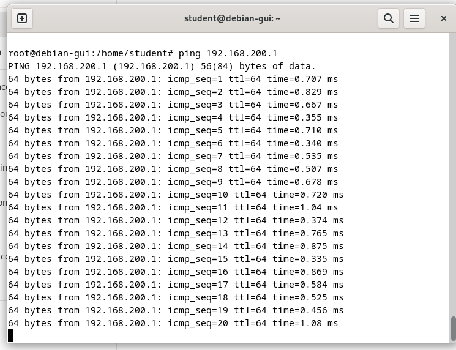

# DNS dan IP Forwarding

## VM 1 Configuration

### Install bind9 & iptables

Install dulu bind9 untuk DNS Server, 
```bash
sudo apt install bind9 bind9utils
```


untuk 'bind9utils' akan digunakan untuk mengecek hasil konfigurasi zones

Kemudian install juga untuk iptables
```bash
sudo apt install iptables iptables-persistent
```


'iptables-persistent' diinstall agar konfigurasi kita bisa disimpan, sehingga tidak perlu mengulang nantinya

### 2 Set IP Addresses

konfigurasi ip address untuk VM 1 dengan mengedit file '/etc/network/interfaces'

```bash
sudo nano /etc/network/interfaces
```


Untuk `enp0s3` adalah network interface primary yang kita hubungkan ke bridge adapter / internet, sedangkan `enp0s8` itu interface secondary yang terhubung ke internal network, nanti akan dihubungkan ke VM 2

Oleh karena itu, konfigurasi `enp0s3` dibiarkan default saja untuk menerima ip address sebagai DHCP client. Sedangkan untuk konfigurasi `enp0s8` diberi IP static `192.168.200.1` dengan netmask `255.255.255.0` atau /24

restart network agar perubahan pada /etc/network/interfaces dapat terjadi

```bash
sudo systemctl restart networking
```

Bisa dicek apakah ip address sudah sesuai melalui 'ip a'

### 3 DNS Configuration

Masuk dulu ke '/etc/bind', kemudian konfigurasi file named.conf

```bash
sudo nano named.conf
```

tambahkan line `include "/etc/bind/named.conf.external-zones"` untuk menambahkan zones yang nantinya akan kita buat


kemudian konfiguerasi file 'named.conf.options'

```bash
sudo nano named.conf.options
```

Tambahkan beberapa line berikut

```bash
allow-query { any; };
allow-transfer { any; };
recursion yes;
```

Kemudian file 'named.conf.external-zones'

```bash
sudo nano named.conf.external-zones
```


Setelah itu, kita perlu membuat 2 zones untuk DNS kita dimana satu untuk nameserver yaitu `kelompok8.com` dan satu lagi untuk IP nya `1.200.168.192.in-addr.arpa`
pada line `file` berikan lokasi file untuk konfigurasi zone nantinya

Untuk konfigurasi zones, pertama saya akan mengonfigurasi file `kelompok8.com`

```bash
sudo nano kelompok8.com
```


selanjutnya file '1.200.168.192.db'

```bash
sudo nano 1.200.168.192.db
```


setelah selesai konfigurasi untuk kedua zones tersebut, kita dapat mengecek apakah ada kesalahan dalam konfigurasi menggunakan perintah `named-checkzone` dari `bind9utils`

```bash
named-checkzone [nama_zone] [file_konfigurasi_zone]
```


jika ditampilkan 'OK' maka tidak ada masalah pada di kedua zone tersebut

kemudian restart 'named.service' untuk menerapkan semua konfigurasinya

```bash
sudo systemctl restart named
```

### 4 Set IP Forwarding

Pertama, ubah nilai ip_forward menjadi 1 agar VM 1 dapat meneruskan IP dengan perintah berikut:

```bash
echo 1 > /proc/sys/net/ipv4/ip_forward
```


Selanjutnya konfigurasi `iptables`, jalankan perintah berikut:

```bash
sudo iptables -t nat -A POSTROUTING -o enp0s3 -j MASQUERADE
```

Perintah tersebut digunakan untuk menambahkan tabel NAT pada iptables dan melakukan MASQUERADE ke ip yang diteruskan ke interface enp0s3 yang terhubung ke Internet Perintah ini berfungsi untuk mentranslasikan ip private ke ip public ke internet

Selanjutnya jalankan perintah berikut:

```bash
sudo iptables -A FORWARD -i enp0s8 -o enp0s3 -j ACCEPT
sudo iptables -A FORWARD -i enp0s3 -o enp0s8 -j ACCEPT
```

Perintah ini akan menambahkan rules untuk meneruskan ip dari interface `enp0s8` ke `enp0s3` dan sebaliknya agar nantinya VM 2 bisa terhubung ke Internet


gunakan perintah berikut untuk menyimpan konfigurasi

```bash
sudo iptables-save
```

## VM 2 Configuration

VM 2 disini sebagai client yang mana kita hanya oerlu mengonfigurasi IP static-nya dengan masuk ke Wired Settings dan masuk keIPv4, isikan address yang satu network dengan IP Address pada 'enp0s8' di VM 1, yaitu '192.168.200.x'


Masukkan juga IP Address 192.168.200.1 pada DNS agar kita dapat terhubung dengan DNS pada VM 1

### ping VM 1

Kita akan mencoba melakukan ping ke IP Address dari VM 1 untuk mengecek konek antara VM 1 dengan VM 2



bisa dilihat bahwa VM 1 dan VM 2 sudah bisa saling berkomunikasi

### Cek Internet

Saya mencoba untuk membuka youtube untuk mengecek VM 2 sudah terhubung internet atau belum


### Cek DNS VM 1

Mencoba DNS yang sudah dikonfigurasi pada VM 1, di VM 2 menggunakan 'dig' / 'nslookup'


bisa dilihat pada output 'dig' sudah menampilkan ANSWER SECTION 

pada output 'nslookup' menampilkan nameserver dan ip addressnya


